---
# try also 'default' to start simple
theme: purplin
# random image from a curated Unsplash collection by Anthony
# like them? see https://unsplash.com/collections/94734566/slidev
# background: https://source.unsplash.com/collection/94734566/1920x1080
background: ./img/84026087_p0.png 
# apply any windi css classes to the current slide
# class: 'text-center'
# https://sli.dev/custom/highlighters.html
highlighter: shiki
# show line numbers in code blocks
lineNumbers: true 
# some information about the slides, markdown enabled
info: |
  ## Slidev Starter Template
  Presentation slides for developers.

  Learn more at [Sli.dev](https://sli.dev)
# persist drawings in exports and build
drawings:
  persist: false

fonts: 
  local: 'JetBrains Mono Extra Bold Nerd Font'
---

# Transformer 

Alternative for RNN and CNN in NLP Problems

Brand-New Architecture for Machine Learning in 2017


<!--
Transformer 
-->

---

# Components


* Encoder-Decoder       - Mechanism used to Deal with Seq2Seq Problems
* Seq2Seq               - Translations, Videos, Anything that involving Sequence
* Attention Mechanism   - Mechanism built to extract similarity and connection in Sequential Data
* Attention on Seq2Seq  - Encoder-Decoder Mechanism conbined with Attention 
* Self-Attention        - Special Attention Mechanism
* Position Encoding     - Encoding Position Information in NLP and other Problems
* Multi-Head Attention  - Process Attention number of times to Extract more information 
* Transformer           - Ultimate Goal

<br>
<br>

<!--
You can have `style` tag in markdown to override the style for the current page.
Learn more: https://sli.dev/guide/syntax#embedded-styles
-->

<style>
h1 {
  background-color: #2B90B6;
  background-image: ./img/84026087_p0.png;
  background-size: 100%;
  -webkit-background-clip: text;
  -moz-background-clip: text;
  -webkit-text-fill-color: transparent;
  -moz-text-fill-color: transparent;
}
</style>

---
layout: two-cols
---
# Decoder-Encoder Mechanism
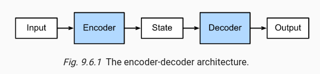


::right::

## Overview

* Seq2Seq
* State: Usually Fixed Size Vector
* Kind of extracted from existing prediction architectures

## Shortcoming
* *Fixed size vector* - Fixed size of Information
* *Long Recurrent* architecture, early information, low proportion, resulting in less impact on the prediction

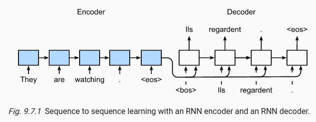

---
layout: two-cols
---
# Seq2Seq

## Training

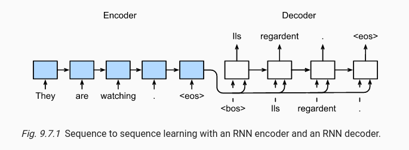

* Translations (Language -> Language)
* Translations (Language -> Instructions)
* Video Transformation
* Combination of both - VLN

::right::


<br>
<br>
<br>

## Prediction
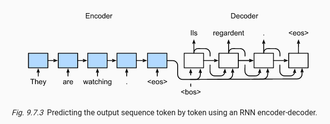

* Use previous output as the input 
* Hidden state for all predictions


---
layout: two-cols
---
# Attention Mechanism

## CNN Pooling initiation
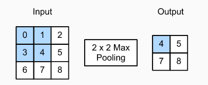
* Max Pooling: Extract the maximum `feature` from the input object
* The number chosen are not of intentions (subjective).
* Related only to the fact (objective).


::right::

## Attention cues in Biology


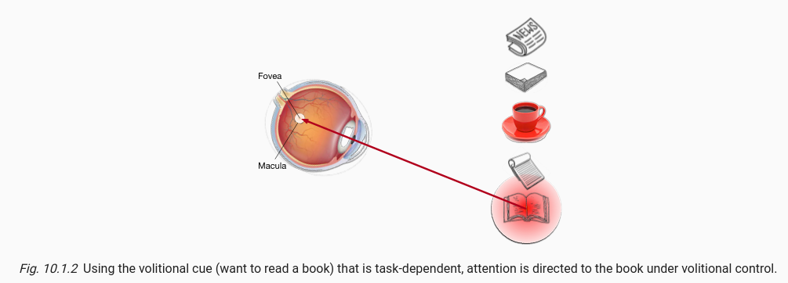

---
layout: two-cols
---
# Volition and non-volition
  Non-volition: (Key, Value), Volition: Query

* Key: The known fact about the object.
* Value: The object itself or the value of an object.
* Query: Your intention.

* Extract Specific Values according to the **similarity** between the corresponding key and input query

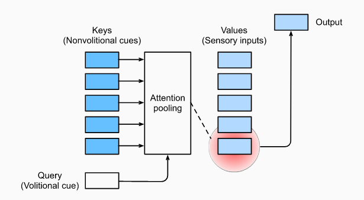
::right::


```json
Key-Value Pairs={
  (Easy to read, Newspaper),
  (Entertained to read, Science fiction),
  (Wakes you up, Coffee),
  (Note down your thoughts, Notebook),
  (Hard to read but gain knowledge, Science Paper),
}
Query = "After drinking coffee, I want to study"
```

---
layout: two-cols
---
# Maths on Attention

## Non-Volition 

$f(x) = \frac{1}{n}\sum_iy_i$ 
  * $x$ -> Query, $y_i$ -> Value

## Volition 
* but No Parameters to Learn

$f(x) = \sum_i^n\alpha(-\frac{1}{2}(x-x_i)^2)*y_i$

* $x$ -> Query, $y_i$ -> Value, $x_i$ -> Key

* with Parameters to Learn

$f(x) = \sum_i^n\alpha(-\frac{1}{2}((x-x_i)w)^2)*y_i$

* $x$ -> Query, $y_i$ -> Value, $x_i$ -> Key

::right::
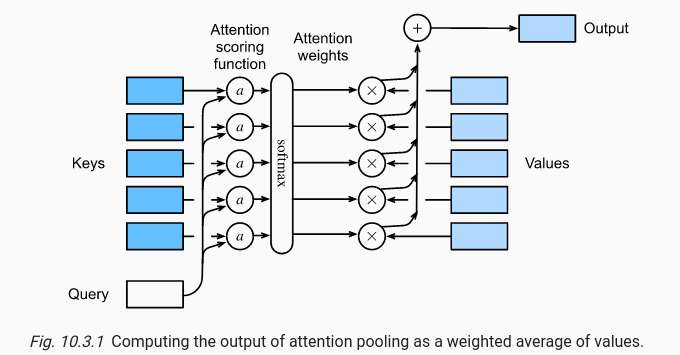

## Transformer 

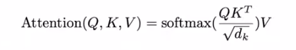

* Q and K are vectors
* Inner Product


---
layout: two-cols
---
# Attention and Seq2Seq
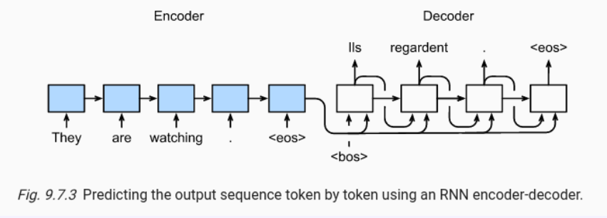

* Early Information gain low proportion, showing little impact in large sequential problems

* Limited information can be stored in a fixed sized vector

::right::

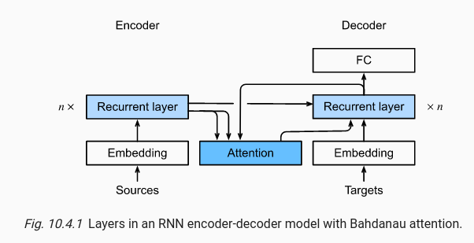
* Store all the hidden states
* (Key = Value) = hidden vector
* Query: Last prediction
* Choose the related Hidden vector for the next prediction
* Information can be preserved equally
* Require larger memory to store the hidden states

---
layout: two-cols
---
# Self-Attention 
Where Key = Value and Query is one of the keys

$$
Att_i = f(x_i, \{(x_1,x_1), (x_2,x_2),...,(x_n,x_n)\})\in R^d \\
= \sum_{j=1}^nSoftmax(-\frac{1}{2}(x_i-x_j)^2)*x_j
$$

* I grew up in **France**, ..., so I can speak **French**. 

<br>

* Attention based encoder

* $d$: Length of the vector
* $k$: Length of the window in CNN
* $n$: number of Nodes
* Longest Path: Longest path of gathering Information from all the Nodes
::right::
## Comparison


|              | CNN        | RNN       | Self-Attention   |
| ------------ | -----      | -----     | ---------------- |
| Complexity   | $O(knd^2)$ | $O(nd^2)$ | $O(n^2d)$        |
| Parallel     | $O(n)$     | $O(1)$    | $O(n)$           |
| Longest Path | $O(n/k)$   | $O(n)$    | $O(1)$           |

---
layout: image-right
image: ./img/image_2022-07-08-15-22-16.png
---
# Transformer
Totally rely on Attention, In NLP Example

## Encoder
* Sources: English Sentence
  * All words can be sent as one input (Self attention)
* Embedding: Word -> Vectors
* Positional Encoding
  * Attention don't care about positions
  * Add bias according to its positions
* Multi-Head Attention - Multi channel in CNN
* Add & Norm
  * Normalise Output, reduce Gradient Explosion

---
layout: image-right
image: ./img/image_2022-07-08-15-22-16.png
---
# Transformer
Totally rely on Attention, In NLP Example


## Decoder
* Target: Chinese Sentence 
  * `<BOS>` as the beginning
  * previous prediction as the input of the next prediction
* Masked - In prediction and training.
  * Can only use previous words to predict future words
* Multi-Head Attention
  * Take Information from Encoder 

---
layout: two-cols
---
# Transformer

Attention Function

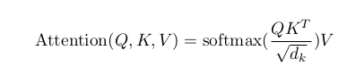

* Inner Product: similarity between Q and K
* Scale: $\sqrt d_k$, Normalise it down to acceptable Range
* Mask: In Training Process, mask future information 
* SoftMax: Determine weights for each K-V pairs

::right::
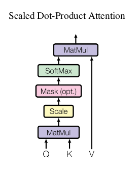


---
layout: two-cols
---
# Transformer
Multi-Head Attention

* Copy V, K, Q h times
* Same as the multi-channel CNN 
* Learn multi features
* Linear: projection to low dimension (Can be learnt)

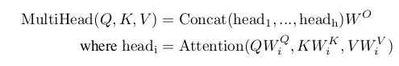
* Stack all output 
* Maintain multiple features extracted

::right::
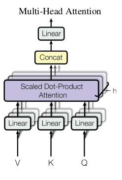

---
layout: two-cols
---
# Transformer
From Encoder to Decoder, Second Multi-Head Attention

## Encoder Input

* Vector of All Attention output
* [n, d]
  * n: Number of words
  * d: Length of each word
* Form (Key, Value)

## Decoder Input
* Attention output of Predicted words
* [m, d]
  * m: number of output words (After Masked)
  * d: Length of each word
* Form Query


::right::
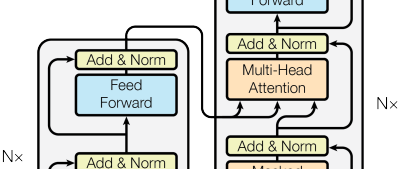
## Example
* "Hello World" to "你好世界"
* When predicting "好", we use "Hello World" as (Key, Value) and "你" as Query
* "World" shall produce low proportion, resulting in little impact on the prediction of "好"

---
layout: two-cols
---
# Transformer
Encoder Simplification
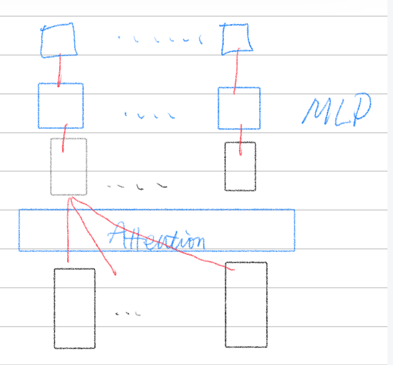
::right::

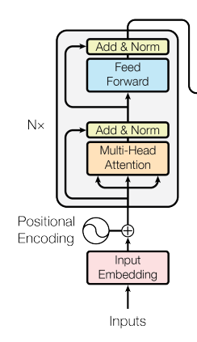

---
layout: two-cols
---
# Transformer
* Too Expensive
* Too Large
* Containing Too little information Requires More Data for Training
* Add and Norm are essential
* Positional Information is still not fully used

---

# VLN and Transformer

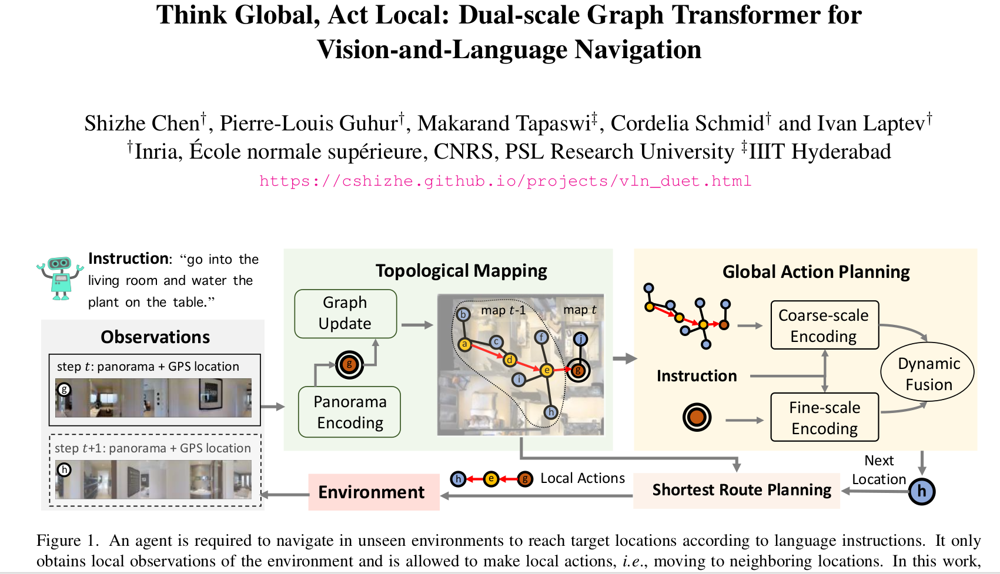

---
layout: two-cols
---
# VLN
Visual Language and Navigation

* Robot takes Language instructions 
* Combine it with visually known environment (Previously Unseen)
* Explore or Navigate to destinations

::right::

## Instructions
* Fine-grained Instructions
* step-by-step navigation guidance such as
  * “Walk out of the bedroom. Turn right and walk down the hallway. At the end of the hallway turn left. Walk in front of the couch and stop”
* Improvement: goal-oriented instructions
  * “Go into the living room and water the plant on the table”
* **SOLUTION**: Transformer


---
layout: two-cols
---
# VLN

## Memory Storage
* condense navigation history in a **fixed-size** vector
* explicitly store with Transformer
* Use Topological Map 

## Fall Back 
* Recurrent: Information Reduction 
* coarse representations: hard for local actions (Decision Making) 
* **SOLUTION**: Dual-scale graph Transformer (DUET) with topological
maps

::right::


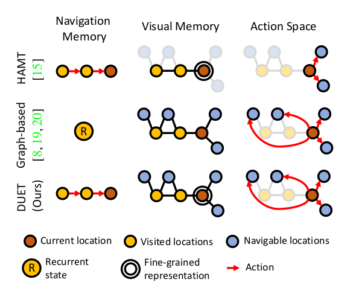

---

# DUET 
Dual-Scale graph Transformer

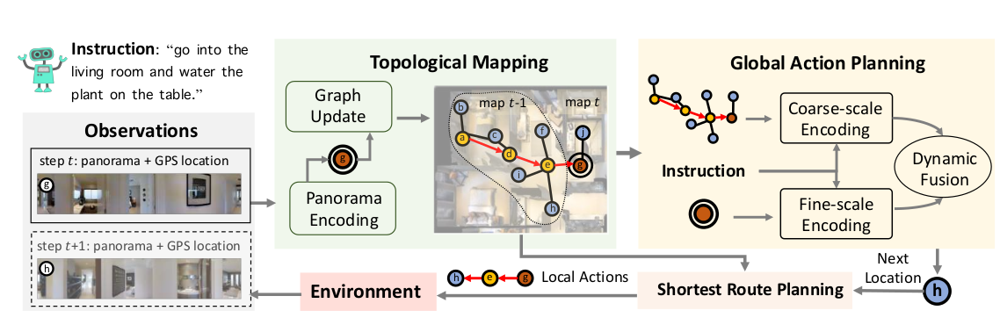

* Topological Mapping
* Global Action Planing

---
layout: two-cols
---

## Topological Mapping

* Add **Newly** observed locations to the Map
* Update visual representations
  * Find-scale of **Current Location**
  * Coarse-scale of **Map**
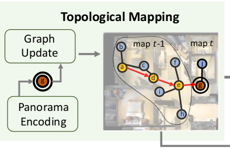
::right::

## Global Action Planing

* Encode **Previous** Information with **Coarse-Scale**
* Encode **LOCAL** node with **Fine-Scale** 
* Combined with Instructions Encoded with **Transformer** to navigate


---
layout: two-cols
---
# Method

## Overview

* Topological Mapping over time
* Global action planning performs on it

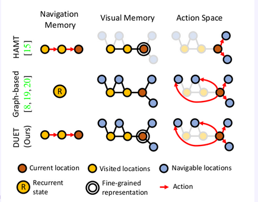

::right::

## Topological Mapping

* 3 types of nodes
* use panoramic views to determine navigable nodes

### Visual Representation of Nodes

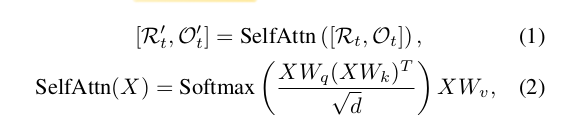

* Self-attention
* $R_t$: Image features after CNN
* $O_t$: Object features after Object-detective Network

* Update navigable Nodes according to Corresponding part in $R_t$ (Panoramic)

---

## Global Action Planning

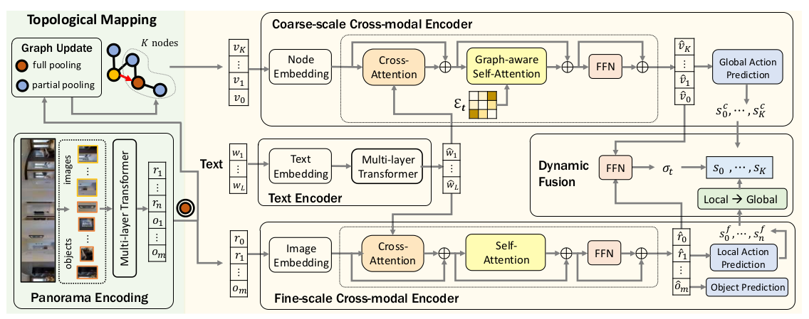

---


